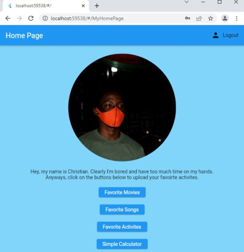
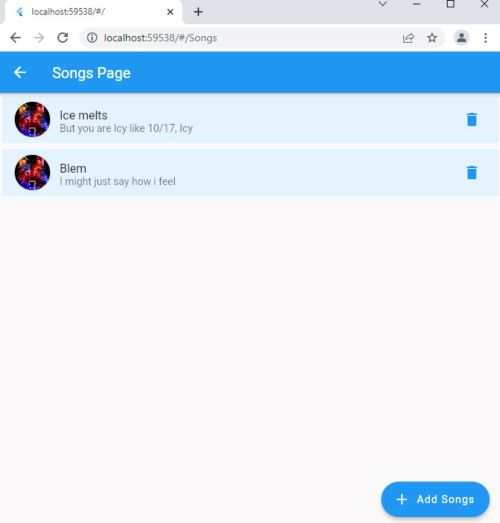
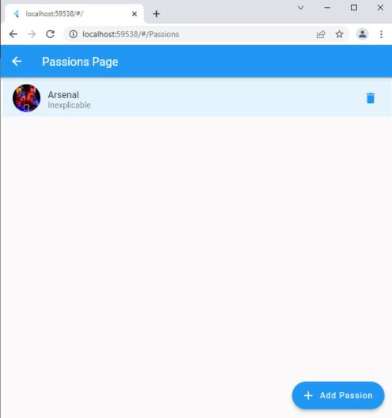

A fullstack mini-websit

# Who am I?

A fullstack webapp built with flutter and firebase. I built this to test out my flutter and firebase skills, while building something of my own. It supports authentication(fireauth) and cloud database(firestore). It uses Getx for state management. 
As challenging as it was, I'm proud I embarked on it, I learnt a lot and become a better developer in the process. 

Ps: Aplogies for the UI, I was doing my best. * Insert sad emoji *

## Getting Started

You'll have to setup your firebase, you can use fireflutter, then initalize it in the home file and you are good to go.
Don't forget to turn on support for fireAuth and fireStore on the firebase website. 

## GUI Preview

